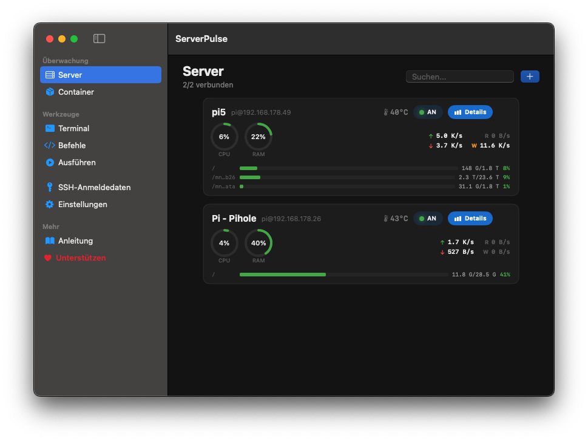
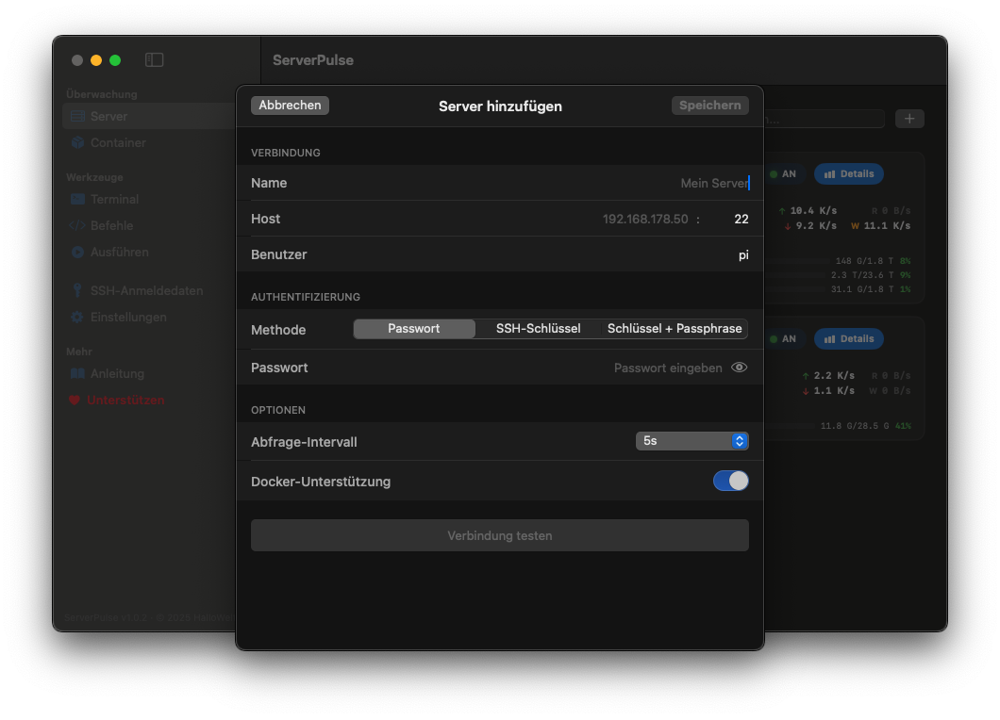
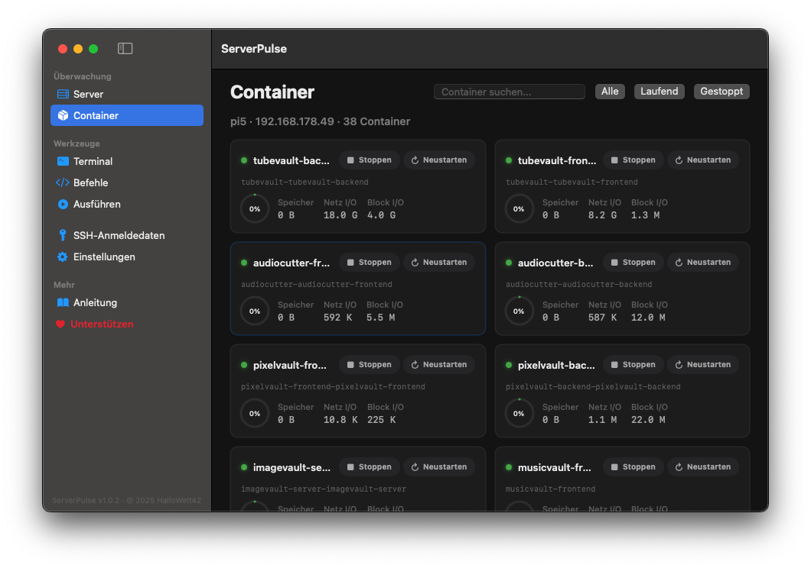
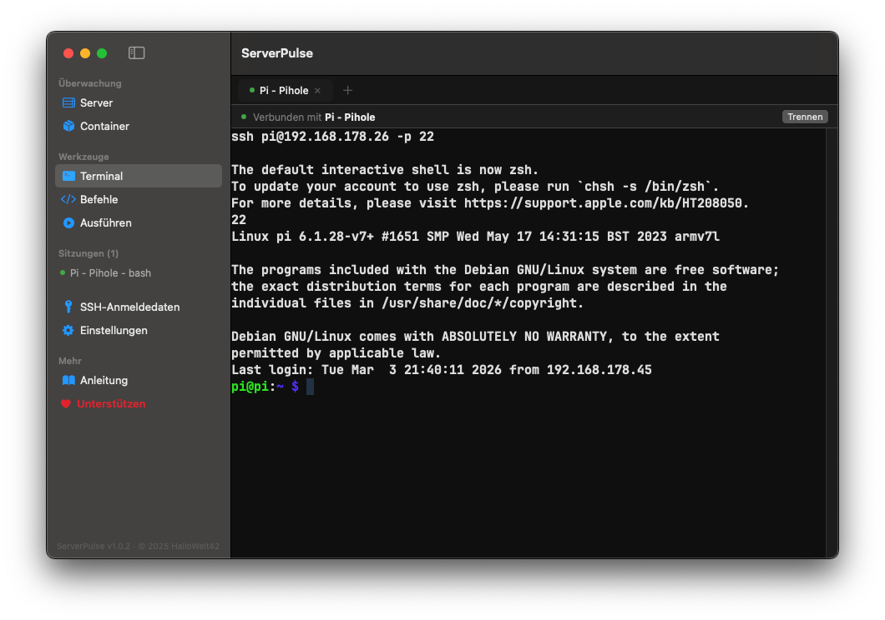
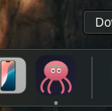

# ServerPulse

A native macOS application for monitoring Linux servers via SSH. Built with SwiftUI and SwiftData.



## Features

- **Server Monitoring** - Real-time CPU, memory, disk, network and temperature metrics via SSH
- **Interactive Terminal** - Multi-tab SSH terminal with configurable fonts (SwiftTerm)
- **Docker Management** - List, start, stop and restart containers
- **Command Execution** - Run commands on multiple servers in parallel
- **Command Snippets** - Organize reusable commands in categories
- **SSH Keychain** - Secure credential storage in macOS Keychain
- **8 Languages** - English, German, French, Spanish, Portuguese, Russian, Japanese, Chinese
- **5 Themes** - Material Dark, Nord, Dracula, Catppuccin Mocha, Tokyo Night

## Requirements

- macOS 14.0 (Sonoma) or later
- Swift 5.9+
- Xcode 15+ or Swift toolchain

## Build

### Using Swift Package Manager

```bash
swift build -c release
```

### Create macOS .app bundle

```bash
chmod +x build-app.sh
./build-app.sh --release
```

The app bundle will be created in `dist/ServerPulse.app`.

### Install

```bash
cp -R dist/ServerPulse.app ~/Applications/
```

## Project Structure

```
ServerPulse/
├── App/                    # App entry point and delegate
├── Models/                 # SwiftData models (Server, Snippet, Metrics, Docker)
├── Theme/                  # Theme system with 5 color presets and UI scaling
├── Utilities/              # ByteFormatter, RingBuffer
├── Services/
│   ├── SSH/                # SSHSession actor, connection manager
│   ├── Metrics/            # MetricsEngine and Linux /proc parsers
│   ├── Docker/             # Container management via SSH
│   ├── Terminal/           # Terminal session lifecycle
│   ├── Persistence/        # SwiftData controller, Keychain service
│   └── Localization/       # JSON-based runtime localization
├── Resources/
│   ├── Localization/       # Language JSON files (de, en, es, fr, ja, pt, ru, zh)
│   └── QRCodes/            # Donation QR code SVGs
└── Views/
    ├── Navigation/         # Sidebar, main content routing
    ├── Components/         # GaugeRing and shared components
    ├── Dashboard/          # Server overview with live metrics
    ├── ServerDetail/       # Detailed server metrics view
    ├── Containers/         # Docker container dashboard
    ├── Terminal/           # Multi-tab SSH terminal
    ├── Hosts/              # Add/edit server sheet
    ├── Execute/            # Multi-server command execution
    ├── Snippets/           # Command snippet manager
    ├── Settings/           # App settings, keychain management
    ├── Donate/             # Support and donation page
    └── Guide/              # App guide and license
```

## Dependencies

- [Citadel](https://github.com/orlandos-nl/Citadel) - SSH client library for Swift
- [SwiftTerm](https://github.com/migueldeicaza/SwiftTerm) - Terminal emulator for macOS

## Adding Languages

Drop a JSON file into `ServerPulse/Resources/Localization/` following the existing format (e.g. `it.json` for Italian). The file will be detected automatically at runtime. See `en.json` for the full list of keys.

## Screenshots

| Add Server | Docker Containers |
|:---:|:---:|
|  |  |

| Terminal | App Icon |
|:---:|:---:|
|  |  |

## License

ServerPulse Non-Commercial License v1.0 - Based on CC BY-NC-ND 4.0

See [LICENSE](LICENSE) for details.
